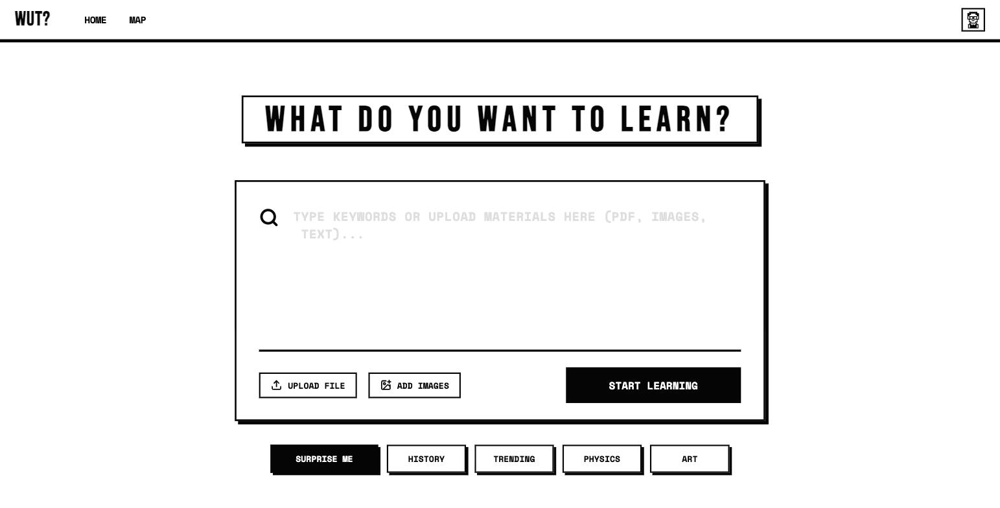
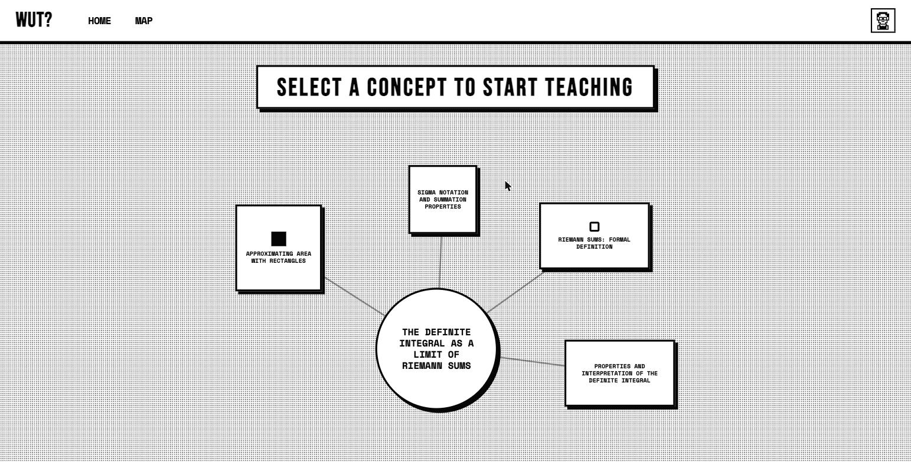
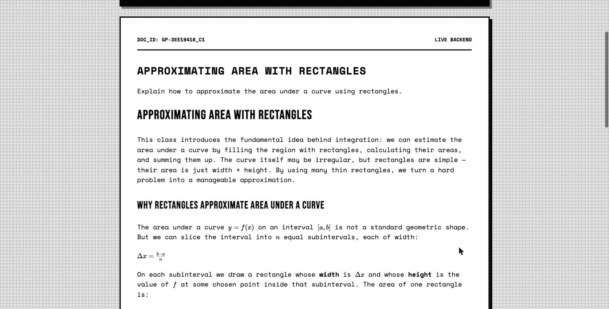
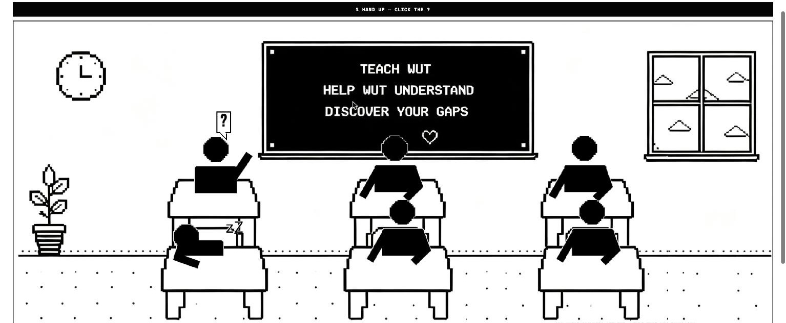
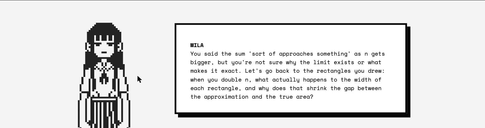
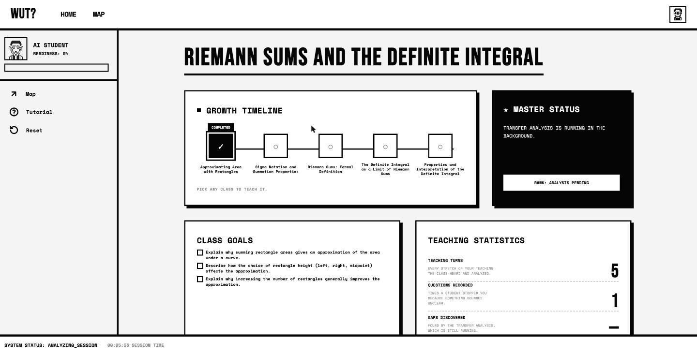

<p align="center">
  
</p>

**You learn by teaching. We measure whether it worked.**

Give it a topic. It builds a short course, hands you a one-page primer, and sits you in front of a
classroom of AI students who know nothing. You teach out loud. They only ask, restate, or admit
confusion — and they interrupt exactly when you sound unsure. Afterwards we test how much they
actually learned from you.



## The idea

Most study tools grade your answers. We grade your *explanation*, by experiment rather than by
rubric, using two signals:

**How you sounded while teaching.** Every utterance is scored on a GPU for hesitation,
self-contradiction, and factual error against the class being taught — one `confidence` value from
0 to 1 per utterance.

**Whether the lesson actually taught anything.** After class, AI students who heard your lesson sit
a hidden test. A control group that never heard it takes the same test.
`delta = taught score − cold score`.

Cross the two and you get the cell no rubric can find:

|                    | The lesson worked   | The lesson didn't |
| ------------------ | ------------------- | ----------------- |
| You sounded sure   | mastery             | **blind spot**    |
| You sounded shaky  | productive struggle | aware gap         |

A **blind spot** is something you explained confidently and got completely wrong. That is the thing
worth showing a learner.

## The flow

**1. It builds a course.** About five classes, each with 3–5 objectives you must be able to explain
out loud. Written together, so class 3 doesn't re-teach class 1. Vague topics ("I want to learn
physics") come back as three narrower options to pick from first.



**2. Read the primer.** A short Markdown brief per class, generated once and reused — maths
rendered as maths, and at most one diagram where a structure genuinely helps.



**3. Teach.** Press the mic and explain. The class stays quiet while it follows you; when a student
gets lost a `?` rises over its head. Say "I don't know" and it stops asking and just tells you.



**4. Answer the student who stopped you.** Click the `?` to zoom in. The question quotes the exact
thing that sounded shaky — it is written from your own words, not from a template.



**5. It remembers what you said.** Questions are checked against your whole transcript, so
contradicting yourself two minutes later gets caught.


**6. End the class.** You get the transfer delta, the blind spots, and a readiness score. The next
class remembers what you covered and what you were already asked.



## How it's built

| Service     | Port | Stack                                    | Job                                              |
| ----------- | ---- | ---------------------------------------- | ------------------------------------------------ |
| `frontend/` | 5173 | React 19, Vite, TypeScript               | The pixel-art classroom                          |
| `backend/`  | 8000 | FastAPI, Postgres, DeepSeek              | Courses, teaching turns, measurement, memory     |
| `ml-service/` | 8100 | Whisper, Wav2Vec2, mDeBERTa, judge LLM | The confusion engine, on a rented GPU            |

```
browser ──> backend :8000 ──> ml-service :8100 (GPU)
               ├──> LLM API (DeepSeek)
               └──> Postgres
```

The browser talks only to the backend; only the backend talks to the GPU box. If the GPU box is
down the turn comes back `degraded: true` and the room falls back to typing rather than faking it.

**The confusion engine.** Three checks per utterance that only work together: *audio vs text* (did a
word cost visible effort to say?), *text vs text* (does this contradict what you said two minutes
ago?), and *text vs the syllabus* (is this wrong, off-topic, or correct but ahead of the course? —
the third case grows the course instead of penalising you). The interesting signal is the
disagreement: the words are right, but half of them were a struggle to get out. That is reciting,
not understanding, and no single check catches it.

**Why the class stays quiet.** Every chunk is transcribed and scored, but the class only speaks when
it has a real question — otherwise it costs an LLM round-trip per sentence and the students end up
three sentences behind you. Chunks queue and upload in the background, so you can keep talking.

**What it remembers, per course.** Which concepts you covered, every question already asked (so
nothing is asked twice, but a concept you keep fumbling gets re-probed from a new angle), which
objectives you nailed, and a per-concept struggle score that decays once you finally explain it
clearly.

## Run it

```bash
docker compose up -d db                       # Postgres on :5432

cd backend
python -m venv .venv && source .venv/bin/activate
pip install -r requirements.txt
cp .env.example .env                          # LLM keys + ML_SERVICE_URL
uvicorn app.main:app --reload --port 8000     # API docs at /docs

cd frontend && npm install && npm run dev     # http://127.0.0.1:5173
```

- `.env.example` ships `STORE_BACKEND=db`, so plans, notes and progress survive a restart. Set
  `STORE_BACKEND=memory` to run with no database — but every class is then regenerated, and
  re-billed, after each reload. Tables are created on startup; there is no migration step.
- The **ml-service** runs on a GPU box, not locally. Point the backend at it with `ML_SERVICE_URL`.
  Without it, voice teaching returns `degraded: true` and the UI falls back to typing.
- PDF and image uploads need Tesseract (`brew install tesseract`). Text and Markdown work without it.
- Everything in one container instead: `docker compose up --build`.

## Where the code lives

```
backend/app/
  api/            routes, kept thin
  curriculum/     build.py (course + primers), teaching.py (the live class)
  agents/         the AI student and the question writers
  pipeline/       the measurement: filter, score, grade, attribute
  confusion/      the GPU client and the offline fallback
  store/          in-memory or Postgres, same interface
ml-service/
  engine.py       the three checks and the fusion
  server.py       POST /analyze, GET /health
frontend/src/features/
  learning-data/  every backend call, in one file
  study/          the classroom, the mic, the seats
```

## License

Copyright © 2026 Alibi. All rights reserved.

This is a proprietary project, published publicly so it can be read and evaluated. You may view the
source and run it locally to try it out. Commercial use, production use, redistribution, and
derivative works require written permission. See [LICENSE](LICENSE) for the full terms, and get in
touch if you want one.
